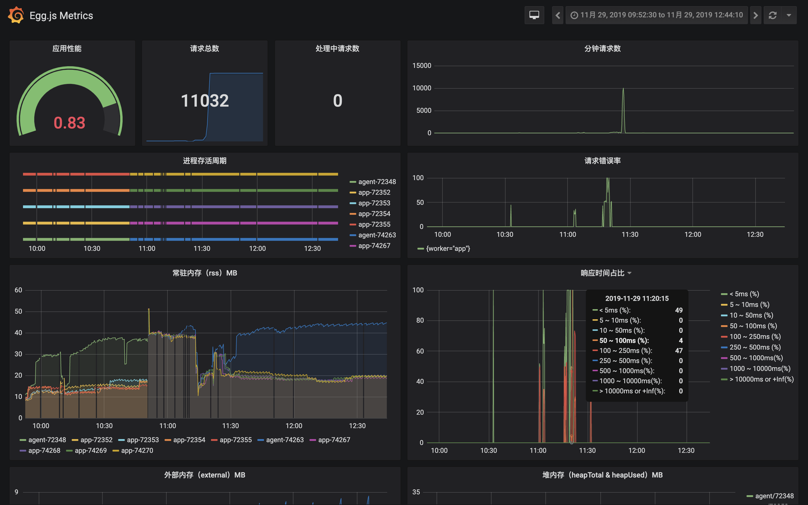

# egg-exporter


[![NPM version][npm-image]][npm-url]
[![npm download][download-image]][download-url]

[npm-image]: https://img.shields.io/npm/v/egg-exporter.svg?style=flat-square
[npm-url]: https://npmjs.org/package/egg-exporter
[download-image]: https://img.shields.io/npm/dm/egg-exporter.svg?style=flat-square
[download-url]: https://npmjs.org/package/egg-exporter

<!--
[![build status][travis-image]][travis-url]
[![Test coverage][codecov-image]][codecov-url]
[![David deps][david-image]][david-url]
[![Known Vulnerabilities][snyk-image]][snyk-url]

[travis-image]: https://img.shields.io/travis/eggjs/egg-prometheus.svg?style=flat-square
[travis-url]: https://travis-ci.org/eggjs/egg-prometheus
[codecov-image]: https://codecov.io/gh/eggjs/egg-prometheus/branch/master/graph/badge.svg
[codecov-url]: https://codecov.io/gh/eggjs/egg-prometheus
[david-image]: https://img.shields.io/david/eggjs/egg-prometheus.svg?style=flat-square
[david-url]: https://david-dm.org/eggjs/egg-prometheus
[snyk-image]: https://snyk.io/test/npm/egg-prometheus/badge.svg?style=flat-square
[snyk-url]: https://snyk.io/test/npm/egg-prometheus
-->

基于 [egg-prometheus](https://github.com/eggjs/egg-prometheus) 开发，增加更多性能指标，为 egg 提供 [Prometheus](https://prometheus.io) 功能支持。


## 展示



## 安装

```bash
$ npm i egg-exporter --save
```

## 用法

### 开启插件

通过 `${app_root}/config/plugin.js` 配置启动 Prometheus 插件:

```js
exports.exporter = {
  enable: true,
  package: 'egg-exporter',
};
```

### 配置

```js
exports.exporter = {
  scrapePort: 3000,
  scrapePath: '/metrics',
  prefix: 'egg_',
  defaultLabels: { stage: 'dev' },
};
```

- `scrapePort`: 监听的用于采集 metrics 的端口
- `scrapePath`: 监听的采集 metrics 的服务路径
- `prefix`: 指定 metrics 名称的前缀
- `defaultLabels`: 默认的 metrics 标签，全局生效

## 内置的 Metrics

- `http_request_duration_milliseconds histogram`: http 请求耗时
- `http_request_size_bytes summary`: http 请求 body 大小
- `http_response_size_bytes summary`: http 响应 body 大小
- `http_request_total counter`: http 请求数
- `http_all_errors_total counter`: http 错误数
- `http_all_request_in_processing_total gauge`: http 处理中请求数
- `process_resident_memory_bytes gauge`: 驻留内存大小
- `nodejs_heap_size_total_bytes gauge`: 已申请堆内存大小
- `nodejs_heap_size_used_bytes gauge`: 已使用堆内存大小
- `nodejs_external_memory_bytes gauge`: V8 管理的，绑定到 Javascript 的 C++ 对象的内存使用情况
- `nodejs_version_info`: 版本信息

当 egg-rpc-base 插件开启时，还会提供下面 metrics
- `rpc_consumer_response_time_ms summary`: rpc 客户端请求耗时
- `rpc_consumer_request_rate counter`: rpc 客户端请求数
- `rpc_consumer_fail_response_time_ms summary`: rpc 客户端失败的请求耗时
- `rpc_consumer_request_fail_rate counter`: rpc 客户端失败的请求数
- `rpc_consumer_request_size_bytes summary`: rpc 请求大小统计
- `rpc_consumer_response_size_bytes summary`: rpc 响应大小统计
- `rpc_provider_response_time_ms summary`: rpc 服务端处理时间
- `rpc_provider_request_rate counter`: rpc 服务端收到请求数
- `rpc_provider_fail_response_time_ms summary`: rpc 服务端失败的请求处理时间
- `rpc_provider_request_fail_rate counter`: rpc 服务端失败的请求数

## 自定义 Metrics

可以通过下面 API 自定义业务 metrics
```js
const counter = new app.prometheus.Counter({
  name: 'xxx_total',
  help: 'custom counter',
  labelNames: [ 'xxx' ],
});

const gauge = new app.prometheus.Gauge({
  name: 'xxx_gauge',
  help: 'custom gauge',
  labelNames: [ 'xxx' ],
});

const histogram = new app.prometheus.Histogram({
  name: 'xxx_histogram',
  help: 'custom histogram',
  labelNames: [ 'xxx' ],
});

const summary = new app.prometheus.Summary({
  name: 'xxx_summary',
  help: 'custom summary',
  labelNames: [ 'xxx' ],
});
```

## 如何贡献

请告知我们可以为你做些什么，不过在此之前，请检查一下是否有[已经存在的Bug或者意见](https://github.com/highso-fe/egg-exporter/issues)。

## License

[MIT](LICENSE)
